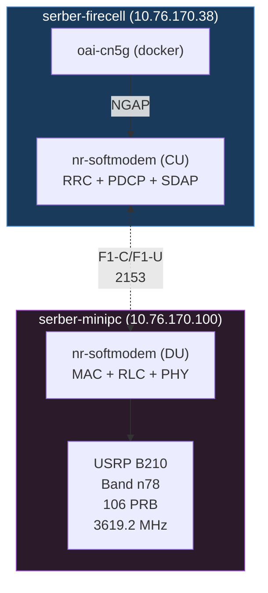

# CU/DU Split: 5G NR Deployment

A distributed OAI 5G NR stack with **CU/DU split** across two hosts:

- **serber-firecell** (10.76.170.38) — CU (RRC + PDCP + SDAP) + 5G Core Network
- **serber-minipc** (10.76.170.100) — DU (MAC + RLC + PHY) + USRP B210

## Topology



## Interfaces

| Interface | From → To | Protocol | IP:Port |
|---|---|---|---|
| NG | CU → AMF | NGAP | 192.168.71.129 → 192.168.71.132:38412 |
| F1-C / F1-U | CU ↔ DU | SCTP / GTP-U | 10.76.170.38 ↔ 10.76.170.100:2153 |

## Network Parameters

| Parameter | Value |
|---|---|
| PLMN | MCC 001, MNC 01 |
| Band | n78 (3300–3800 MHz) |
| BW | 106 PRB @ 30 kHz SCS |
| absoluteFrequencySSB | 641280 (3619.2 MHz) |
| dl_absoluteFrequencyPointA | 640008 |
| TAC | 1 |
| USRP (DU) | B210 serial `8002816` |
| RF gains | `att_tx=3`, `att_rx=12` |

## UE Subscriber (Nothing Phone)

| Field | Value |
|---|---|
| IMSI | 001010000059449 |
| DNN | oai |
| S-NSSAI | SST=1, SD=FFFFFF |
| UE IP | 10.0.0.6 |
| AMF | 8000 |
| Ki | 5686e601f3a1942d4c5cd262ba6b4b20 |
| OPc | aeb1cabd8ed7a09b48d17eb3d8af172c |
| AKA | 5G_AKA / milenage |

## Repository Setup

```bash
git clone https://github.com/promaaa/cu-du.git ~/cu-du
```

## Prerequisites

### Both Hosts

```bash
sudo apt update && sudo apt install -y \
  autoconf automake build-essential ccache cmake cpufrequtils \
  doxygen ethtool g++ git inetutils-tools libboost-all-dev \
  libncurses-dev libusb-1.0-0 libusb-1.0-0-dev libusb-dev \
  python3-dev python3-mako python3-numpy python3-requests \
  python3-scipy python3-setuptools python3-ruamel.yaml \
  libsqlite3-dev libblas-dev libopenblas-dev \
  libhiredis-dev liblapacke-dev sshpass
```

### Core Network Host (serber-firecell)

```bash
sudo apt install -y ca-certificates curl
sudo install -m 0755 -d /etc/apt/keyrings
sudo curl -fsSL https://download.docker.com/linux/ubuntu/gpg -o /etc/apt/keyrings/docker.asc
sudo chmod a+r /etc/apt/keyrings/docker.asc
echo "deb [arch=$(dpkg --print-architecture) signed-by=/etc/apt/keyrings/docker.asc] https://download.docker.com/linux/ubuntu $(. /etc/os_release && echo "${UBUNTU_CODENAME:-$VERSION_CODENAME}") stable" | sudo tee /etc/apt/sources.list.d/docker.list > /dev/null
sudo apt update && sudo apt install -y docker-ce docker-ce-cli containerd.io docker-buildx-plugin docker-compose-plugin
sudo usermod -a -G docker $(whoami)
# Reboot required
```

### DU Host (serber-minipc)

```bash
# Set CPU governor to performance
for f in /sys/devices/system/cpu/cpu*/cpufreq/scaling_governor; do echo performance > $f; done

# Enable USB max current for USRP B210
echo 'usb_max_current_enable=1' | sudo tee -a /boot/firmware/config.txt
```

## Build UHD from Source

```bash
git clone https://github.com/EttusResearch/uhd.git ~/uhd
cd ~/uhd && git checkout v4.8.0.0
cd host && mkdir build && cd build && cmake ../ && make -j$(nproc) && sudo make install && sudo ldconfig
sudo uhd_images_downloader
```

## Build OAI nr-softmodem

```bash
git clone https://gitlab.eurecom.fr/oai/openairinterface5g.git ~/openairinterface5g
cd ~/openairinterface5g && git checkout 102965a669b9444857c27843ec8ce62780bf9d37

# Install dependencies
cd cmake_targets && sudo ./build_oai -I

# Build nr-softmodem
sudo ./build_oai -w USRP --ninja --gNB -C
```

## Core Network Setup

Download and start the OAI CN5G:

```bash
wget -O ~/cu-du/oai-cn5g.zip \
  https://gitlab.eurecom.fr/oai/openairinterface5g/-/archive/develop/openairinterface5g-develop.zip?path=doc/tutorial_resources/oai-cn5g
unzip ~/cu-du/oai-cn5g.zip
mv ~/openairinterface5g-develop-doc-tutorial_resources-oai-cn5g/doc/tutorial_resources/oai-cn5g ~/cu-du/oai-cn5g
rm -rf ~/openairinterface5g-develop*

cd ~/cu-du/oai-cn5g && docker compose -f docker-compose.yaml pull
```

## Configuration

Configuration is generated from YAML files in `conf/`:

```yaml
# conf/minipc-cu-cfg.yml (CU side)
host: serber-firecell
role: cu
plmn:
  mcc: 1
  mnc: 1
  mnc_length: 2
amf:
  ip: 192.168.71.132
  port: 38412
cu:
  f1c_ip: 10.76.170.38
  f1c_port: 2153
  f1u_ip: 10.76.170.38
  ng_ip: 192.168.71.129
  gnb_id: 0xe00
  gnb_name: gNB-CU-MINIPC
  tac: 1
```

```yaml
# conf/minipc-cfg.yml (DU side)
host: serber-minipc
role: minipc
plmn:
  mcc: 1
  mnc: 1
  mnc_length: 2
cu:
  f1c_ip: 10.76.170.100
  f1c_port: 2153
  f1u_ip: 10.76.170.100
  remote_f1c_ip: 10.76.170.38
  remote_f1c_port: 2153
  gnb_id: 0xe00
  gnb_du_id: 0xe01
  gnb_name: gNB-CU-MINIPC
  tac: 1
usrp:
  type: b200
  serial: 8002816
  band: 78
  prb: 106
  clock_src: internal
  max_pdschReferenceSignalPower: -27
  max_rxgain: 114
  att_tx: 3
  att_rx: 12
```

Generate configs:
```bash
python3 scripts/generate-configs.py minipc-cu   # on serber-firecell
python3 scripts/generate-configs.py minipc      # on serber-minipc
```

## Running the Stack

### On serber-firecell

```bash
# Clone CU repo if needed
git clone https://github.com/promaaa/cu-du.git ~/cu-du-minipc

# Start core network
cd ~/cu-du-minipc/oai-cn5g-minipc
docker compose -f docker-compose-minipc.yaml up -d
sleep 20

# Seed UE subscriber
docker exec -i oai-cn5g-minipc-mysql-1 mysql -u root -plinux -D oai_db <<SQL
REPLACE INTO AuthenticationSubscription
    (ueid, authenticationMethod, encPermanentKey, protectionParameterId, sequenceNumber,
     authenticationManagementField, algorithmId, encOpcKey, encTopcKey,
     vectorGenerationInHss, n5gcAuthMethod, rgAuthenticationInd, supi)
VALUES
    ('001010000059449', '5G_AKA', '5686e601f3a1942d4c5cd262ba6b4b20', '5686e601f3a1942d4c5cd262ba6b4b20',
     '{"sqn": "000000000000", "sqnScheme": "NON_TIME_BASED", "lastIndexes": {"ausf": 0}}',
     '8000', 'milenage', 'aeb1cabd8ed7a09b48d17eb3d8af172c', NULL, NULL, NULL, NULL, '001010000059449');
SQL

# Apply UPF traffic shaping
docker exec oai-cn5g-minipc-oai-upf-1 tc qdisc replace dev tun0 root tbf rate 1500Kbit burst 8Kb lat 400ms

# Start CU
cd ~/cu-du-minipc/source/openairinterface5g/cmake_targets/ran_build/build
sudo ./nr-softmodem -O ~/cu-du-minipc/source/openairinterface5g/targets/PROJECTS/GENERIC-NR-5GC/CONF/gnb-cu-minipc.conf --log_config.global_log_level info
```

### On serber-minipc

```bash
# Reset USRP if needed
sudo /usr/local/lib/uhd/utils/b2xx_fx3_utils -U

# Start DU
cd ~/cu-du/source/openairinterface5g/cmake_targets/ran_build/build
sudo ./nr-softmodem -O ~/cu-du/source/openairinterface5g/targets/PROJECTS/GENERIC-NR-5GC/CONF/gnb-minipc.conf --log_config.global_log_level info -E
```

### Verify

```bash
# Check AMF registration
docker logs oai-cn5g-minipc-oai-amf-1 2>&1 | grep -E "gNB|5GMM-REGISTERED"

# Check UPF data
docker exec oai-cn5g-minipc-oai-upf-1 ifconfig tun0 | grep -E "RX|TX"

# Check F1 link in CU log
tail /tmp/cu-minipc.log | grep -E "F1|Connected"
```

## Troubleshooting

### DU F1 Connection Refused
- Verify CU is listening: `sudo ss -ulnp | grep 2153`
- Check CU log for F1AP started: `tail /tmp/cu-minipc.log | grep F1AP`

### USRP Not Found
```bash
sudo /usr/local/lib/uhd/utils/b2xx_fx3_utils -U
sudo uhd_find_devices
```

### UE No 5G Bars
- Verify PRB is 106: `grep dl_carrierBandwidth ~/cu-du/source/openairinterface5g/targets/PROJECTS/GENERIC-NR-5GC/CONF/gnb-minipc.conf`
- Check absoluteFrequencySSB is 641280
- Toggle airplane mode on the phone

### AUSF "Resource not found"
Subscriber not in database — re-run the seed SQL above.

### Docker Network Conflicts
If containers fail to start with "networks have same bridge name", ensure the compose file uses a unique bridge name (e.g., `oai-cn5g-minipc` not `oai-cn5g`).

## Scripts

| Script | Description |
|---|---|
| `scripts/generate-configs.py` | Generate gnb configs from YAML (`cu`, `pi`, `minipc`, `minipc-cu`, `minipc-all` modes) |
| `roles/cn/start.sh` | Start core network containers |
| `roles/cu/start.sh` | Start CU process |
| `roles/pi/start.sh` | Start DU process (serber-pi) |

## Deployment History

| Date | Setup | Status |
|---|---|---|
| 2026-05-17 | CU/DU split serber-firecell + serber-minipc | Working — 5G bars + internet |