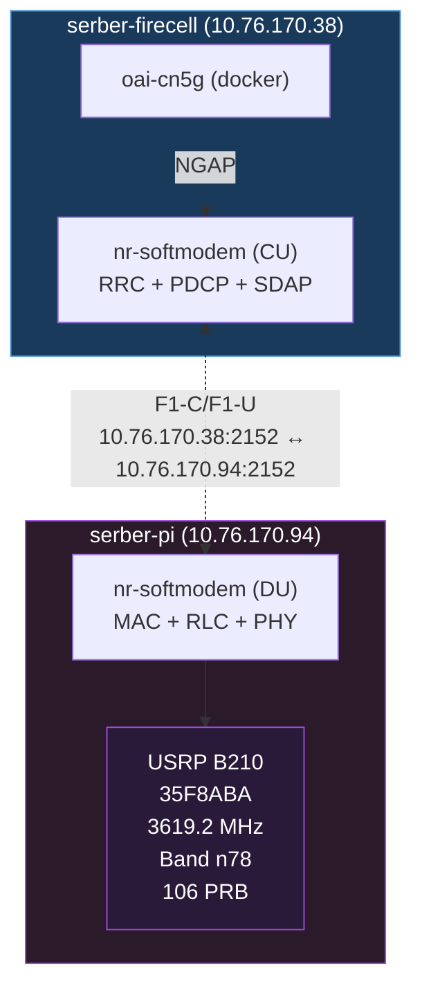

# CU/DU Split: 5G NR Emission

This repository sets up a distributed OAI 5G NR stack with a **CU/DU split** across two hosts:

- **serber-firecell** (CU: RRC + PDCP + SDAP) + Core Network
- **serber-pi** (DU: MAC + RLC + PHY) + USRP B210

The goal is to demonstrate that the split architecture can successfully emit a 5G signal and allow a UE to connect.

## Topology

### Supported Topology: serber-pi as DU



### Interface Summary

| Interface | From → To | Protocol | IP |
|---|---|---|---|
| NG | CU → AMF | NGAP | 192.168.70.129 → 192.168.70.132 |
| F1-C/F1-U (pi) | CU ↔ DU | SCTP/GTP-U | CU: 10.76.170.38, PI: 10.76.170.94, port 2152 |

## Repository Setup

Clone this repository on both hosts:

```bash
git clone https://github.com/promaaa/cu-du.git ~/cu-du
```

## Prerequisites

### Both Hosts

```bash
sudo apt update
sudo apt install -y \
  autoconf automake build-essential ccache cmake cpufrequtils \
  doxygen ethtool g++ git inetutils-tools libboost-all-dev \
  libncurses-dev libusb-1.0-0 libusb-1.0-0-dev libusb-dev \
  python3-dev python3-mako python3-numpy python3-requests \
  python3-scipy python3-setuptools python3-ruamel.yaml \
  libsqlite3-dev libblas-dev libopenblas-dev \
  libhiredis-dev liblapacke-dev
```

### Core Network Host (serber-firecell)

```bash
sudo apt install -y ca-certificates curl
sudo install -m 0755 -d /etc/apt/keyrings
sudo curl -fsSL https://download.docker.com/linux/ubuntu/gpg -o /etc/apt/keyrings/docker.asc
sudo chmod a+r /etc/apt/keyrings/docker.asc
echo "deb [arch=$(dpkg --print-architecture) signed-by=/etc/apt/keyrings/docker.asc] https://download.docker.com/linux/ubuntu $(. /etc/os-release && echo "${UBUNTU_CODENAME:-$VERSION_CODENAME}") stable" | sudo tee /etc/apt/sources.list.d/docker.list > /dev/null
sudo apt update
sudo apt install -y docker-ce docker-ce-cli containerd.io docker-buildx-plugin docker-compose-plugin
sudo usermod -a -G docker $(whoami)
# Reboot required
```

## Build UHD from Source

> Only needed once per host.

```bash
git clone https://github.com/EttusResearch/uhd.git ~/uhd
cd ~/uhd
git checkout v4.8.0.0
cd host
mkdir build && cd build
cmake ../
make -j$(nproc)
make test || true
sudo make install
sudo ldconfig
sudo uhd_images_downloader
```

Verify:
```bash
sudo uhd_find_devices
```

## Build OAI nr-softmodem

```bash
git clone https://gitlab.eurecom.fr/oai/openairinterface5g.git ~/openairinterface5g
cd ~/openairinterface5g
git checkout 102965a669b9444857c27843ec8ce62780bf9d37

# Install dependencies
cd cmake_targets
sudo ./build_oai -I

# Build nr-softmodem (CU build is lighter, DU build uses -j4 cap for limited cores/RAM)
sudo ./build_oai -w USRP --ninja --gNB -C
```

> **Note:** On serber-pi, cap parallelism at `-j4` due to limited cores/RAM.

## Core Network Setup

Download OAI CN5G configs:

```bash
wget -O ~/cu-du/oai-cn5g.zip \
  https://gitlab.eurecom.fr/oai/openairinterface5g/-/archive/develop/openairinterface5g-develop.zip?path=doc/tutorial_resources/oai-cn5g
unzip ~/cu-du/oai-cn5g.zip
mv ~/openairinterface5g-develop-doc-tutorial_resources-oai-cn5g/doc/tutorial_resources/oai-cn5g \
  ~/cu-du/oai-cn5g
rm -rf ~/openairinterface5g-develop*
```

Pull Docker images:
```bash
cd ~/cu-du/source/oai-cn5g
docker compose -f docker-compose.yaml pull
```

## Running the Stack

### Step 1: Clean Up

On **serber-firecell**:
```bash
pkill -f nr-softmodem || true
```

On **serber-pi**:
```bash
pkill -f nr-softmodem || true
```

### Step 2: Start CU + CN (serber-firecell)

```bash
cd ~/cu-du
roles/cu/start.sh
```

### Step 3: Start PI DU

```bash
cd ~/cu-du
roles/pi/start.sh
```

> Start the CU first. The DU will connect to the CU's F1-C at `10.76.170.38:2152`.

### Stop

```bash
# On serber-firecell
roles/cu/stop.sh

# On serber-pi
roles/pi/stop.sh
```

## Verify Operation

```bash
~/cu-du/scripts/check-health.sh
```

Expected checks:
- CU process alive on serber-firecell
- DU process alive on serber-pi
- CN containers healthy on serber-firecell
- F1 link established (`F1 Setup` in logs)
- AMF registered (`NGAP_REGISTER_GNB_CNF`)

## Network Parameters

| Parameter | Value |
|---|---|
| PLMN | MCC 001, MNC 01 |
| Band | n78 (3300–3800 MHz) |
| BW | 106 PRB @ 30 kHz SCS |
| AbsoluteFrequencySSB | 641280 (3619.2 MHz) |
| dl_absoluteFrequencyPointA | 640008 |
| DU RF gains | `att_tx=3`, `att_rx=12` |
| TAC | 1 |
| USRP (DU) | B210 serial `35F8ABA` |

## Deployment Scripts

| Script | Description |
|---|---|
| `scripts/deploy-cu.sh` | Clone + build CU on serber-firecell |
| `scripts/deploy-pi.sh` | Clone + build DU on serber-pi |
| `scripts/check-health.sh` | Verify all components running |
| `scripts/validate-working-config.sh` | Fail if generated configs drift from the working baseline |
